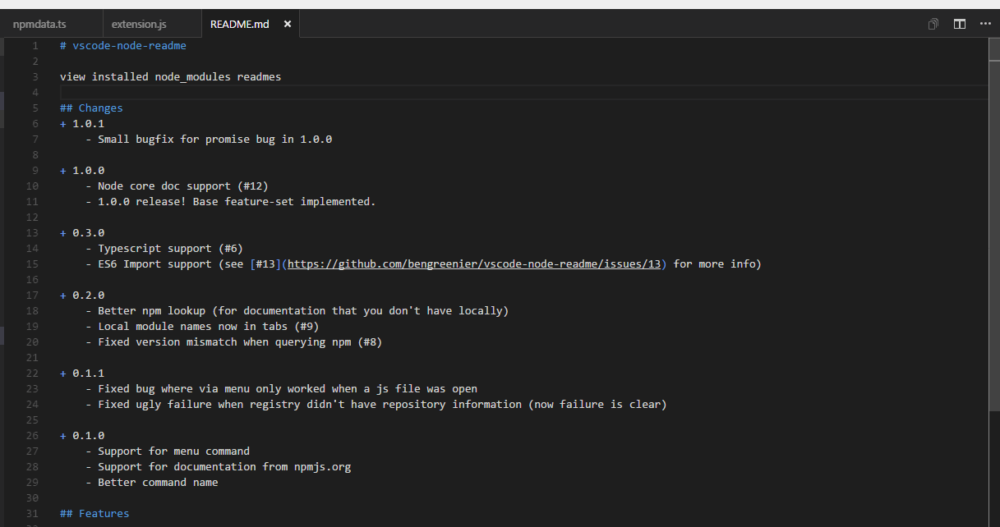

# vscode-node-readme

[](https://marketplace.visualstudio.com/items?itemName=bengreenier.vscode-node-readme)
[](https://marketplace.visualstudio.com/items?itemName=bengreenier.vscode-node-readme)
[](https://marketplace.visualstudio.com/items?itemName=bengreenier.vscode-node-readme)

View installed node_modules readmes



## Keybinding

If you wish to change the key binding for this behavior, do the following:

+ File -> Preferences -> Keyboard Shortcuts
+ Search for "nodeReadme"
+ Click on the pencil icon to edit

## Custom overrides

If you wish to load a document that isn't the `README.md` file for a particular module, do the following:

+ File -> Preferences -> Settings
+ Search for "nodeReadme"
+ Override `nodeReadme.overrides` with an object containing your overrides indexed by module name

For example: 

```
"nodeReadme.overrides": {
        "angular-infinity": "file://c:/path/to/document",
        "angular2": "https://raw.githubusercontent.com/angular/angular/master/aio/content/guide/ajs-quick-reference.md"
    }
```

This will load that file rather than the official `README.md` as determined from the `npm package`.

## Changes

+ 2.3.0
    - Semver npm lookup bugfix (shoutout to [@CallMeLaNN](https://github.com/CallMeLaNN))
        - Fix npm lookup with semver ranges (see [#31](https://github.com/bengreenier/vscode-node-readme/issues/31))
    - Fix regex activation in invalid cases (see [#30](https://github.com/bengreenier/vscode-node-readme/issues/30))
    - Add back abitrary module lookup input field (see [#30](https://github.com/bengreenier/vscode-node-readme/issues/30))
    
+ 2.2.0
    - Major unix bugfix (shoutout to [@oliversturm](https://github.com/oliversturm))
        - Fix readme vs README filename cross platform issues (see [#24](https://github.com/bengreenier/vscode-node-readme/issues/24))
    - Fix issue with forward-slashes in module names (see [#25](https://github.com/bengreenier/vscode-node-readme/issues/25))

+ 2.1.0
    - Fix usage in non-workspaces fails (see [#22](https://github.com/bengreenier/vscode-node-readme/issues/22))
    - Support custom documentation overrides (see [#15](https://github.com/bengreenier/vscode-node-readme/issues/15))

+ 2.0.0
    - Multi-root support (requires vscode october 2017 update or higher)
    - tsx/jsx support

+ 1.2.0
    - JS `import` support (see [#13](https://github.com/bengreenier/vscode-node-readme/issues/13))
    - Small architectural changes to support future development

+ 1.1.0
    - Fixed plugin to work again!
    - Documented keybindings (and how to change 'em)
    - Default keybinding `ctrl+shift+r` or `cmd+shift+r`
    - command should be logically grouped under navigation (#16)
    - fails when no file is open (#14)

+ 1.0.0 - 1.0.7
    - Node core doc support (#12)
    - 1.0.0 release! Base feature-set implemented.
    - Small bugfix for promise bug in 1.0.0
    - Add example gif to readme
    - Marketplace badges
    - Add icon

+ 0.3.0
    - Typescript support (#6)
    - ES6 Import support (see [#13](https://github.com/bengreenier/vscode-node-readme/issues/13) for more info)

+ 0.2.0
    - Better npm lookup (for documentation that you don't have locally)
    - Local module names now in tabs (#9)
    - Fixed version mismatch when querying npm (#8)

+ 0.1.1
    - Fixed bug where via menu only worked when a js file was open
    - Fixed ugly failure when registry didn't have repository information (now failure is clear)

+ 0.1.0
    - Support for menu command
    - Support for documentation from npmjs.org
    - Better command name

## Features

Quickly open `node_modules` readme files.

### Inline

+ Right click a `require('moduleName')` call in a `js` or `ts` file
+ Select `View Node Module Readme`

### Via Menu

+ Open Menu (`Ctrl+Shift+P` by default on windows)
+ Type `View Node Module Readme`
+ If you have a module highlighted we'll go to that
+ If you do not, we'll prompt for a module name

## Issues?

File them [here](https://github.com/bengreenier/vscode-node-readme/issues). Feel free to contribute code, if you're a developer.

## License

MIT