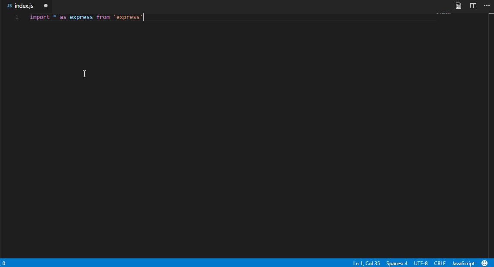
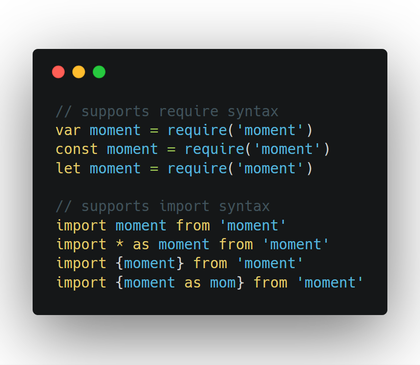
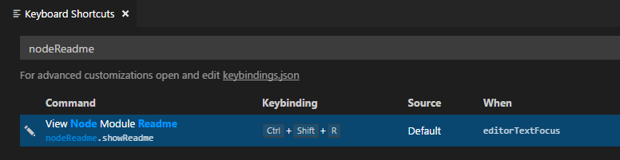
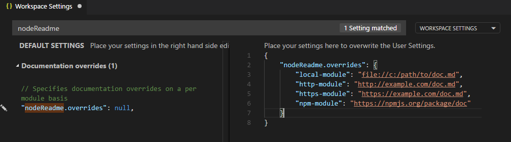

# vscode-node-readme

 

A [vscode](https://code.visualstudio.com) extension to view javascript module documentation __in editor__. 📝 💻

## Features

+ In-editor viewing of documentation
+ Offline documentation for installed modules
+ Online documentation for any module
+ Custom documentation overrides
+ Supports [import](https://developer.mozilla.org/en-US/docs/Web/JavaScript/Reference/Statements/import) syntax
+ Supports [require](https://nodejs.org/api/modules.html#modules_require) syntax

## Supported Languages

This extension supports navigating to documentation from the following programming languages:

* Javascript (js)
* React (jsx)
* Typescript (ts)
* Typescript React (tsx)

## Keybindings

By default, `ctrl+shift+r` (or `cmd+shift+r` on mac) is bound as a shortcut to show the documentation for a module, if the cursor is currently touching that module name.

If you wish to change the key binding for this behavior, do the following:

+ File -> Preferences -> Keyboard Shortcuts
+ Search for "nodeReadme"
+ Click on the pencil icon to edit

## Custom documentation

If you wish to override the documentation that will be provided for a specific module, you can do so using extension settings.

+ File -> Preferences -> Settings
+ Search for "nodeReadme"
+ Override `nodeReadme.overrides` with an object containing your custom documentation overrides indexed by module name

This will load the specified file or module documentation rather than the official `README.md` from the original module.

## Release Notes

Here's a running list of recent changes! :sparkles:

+ 3.0.2
    - Fixed semver issue

+ 3.0.1
    - Updated description
    - Fixed Readme Emojis
    
+ 3.0.0
    - Better documentation
    - Automated tests
        - Refactor to support easier testing
    - Dropped support for older vscode versions
        - Requires `^1.18.0` now

+ 2.3.0
    - Semver npm lookup bugfix (shoutout to [@CallMeLaNN](https://github.com/CallMeLaNN))
        - Fix npm lookup with semver ranges (see [#31](https://github.com/bengreenier/vscode-node-readme/issues/31))
    - Fix regex activation in invalid cases (see [#30](https://github.com/bengreenier/vscode-node-readme/issues/30))
    - Add back abitrary module lookup input field (see [#30](https://github.com/bengreenier/vscode-node-readme/issues/30))
    
+ 2.2.0
    - Major unix bugfix (shoutout to [@oliversturm](https://github.com/oliversturm))
        - Fix readme vs README filename cross platform issues (see [#24](https://github.com/bengreenier/vscode-node-readme/issues/24))
    - Fix issue with forward-slashes in module names (see [#25](https://github.com/bengreenier/vscode-node-readme/issues/25))

+ 2.1.0
    - Fix usage in non-workspaces fails (see [#22](https://github.com/bengreenier/vscode-node-readme/issues/22))
    - Support custom documentation overrides (see [#15](https://github.com/bengreenier/vscode-node-readme/issues/15))

+ 2.0.0
    - Multi-root support (requires vscode october 2017 update or higher)
    - tsx/jsx support

+ 1.2.0
    - JS `import` support (see [#13](https://github.com/bengreenier/vscode-node-readme/issues/13))
    - Small architectural changes to support future development

+ 1.1.0
    - Fixed plugin to work again!
    - Documented keybindings (and how to change 'em)
    - Default keybinding `ctrl+shift+r` or `cmd+shift+r`
    - command should be logically grouped under navigation (#16)
    - fails when no file is open (#14)

+ 1.0.0 - 1.0.7
    - Node core doc support (#12)
    - 1.0.0 release! Base feature-set implemented.
    - Small bugfix for promise bug in 1.0.0
    - Add example gif to readme
    - Marketplace badges
    - Add icon

+ 0.3.0
    - Typescript support (#6)
    - ES6 Import support (see [#13](https://github.com/bengreenier/vscode-node-readme/issues/13) for more info)

+ 0.2.0
    - Better npm lookup (for documentation that you don't have locally)
    - Local module names now in tabs (#9)
    - Fixed version mismatch when querying npm (#8)

+ 0.1.1
    - Fixed bug where via menu only worked when a js file was open
    - Fixed ugly failure when registry didn't have repository information (now failure is clear)

+ 0.1.0
    - Support for menu command
    - Support for documentation from npmjs.org
    - Better command name

-----------------------------------------------------------------------------------------------------------

### For more information

* [Github Issues](https://github.com/bengreenier/vscode-node-readme/issues)
* [Github Page](https://github.com/bengreenier/vscode-node-readme)
* [Marketplace Page](https://marketplace.visualstudio.com/items?itemName=bengreenier.vscode-node-readme)

**Enjoy!**
